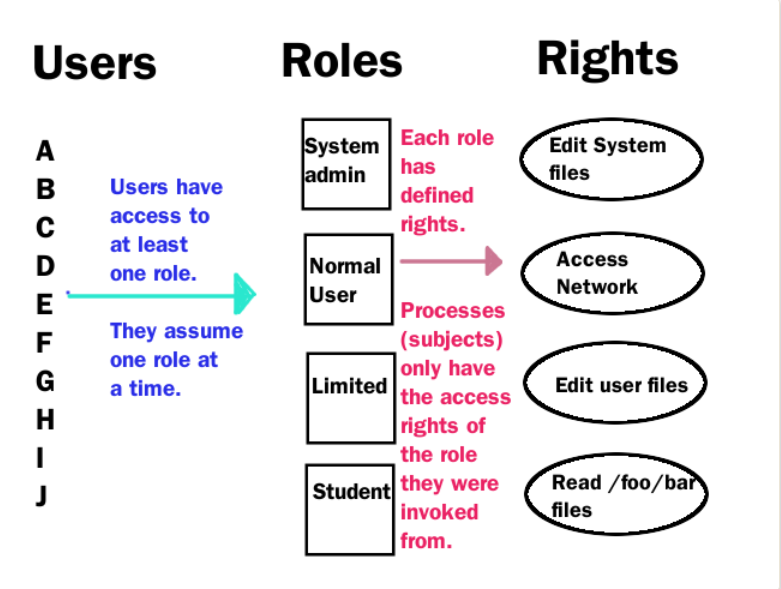
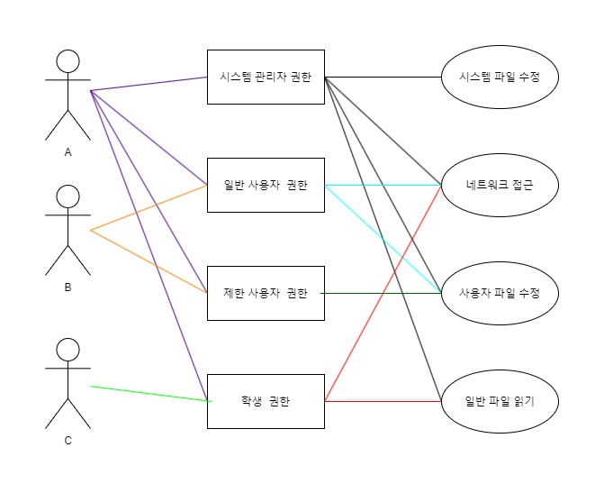

# RBAC 서버 

## 목표 :

- 유저는 N개의 권한을 가질 수 있다.
- 접근 권한이 필요한 메소드들과 N개의 권한을 가질 수 있다.

## 유즈케이스 :

### 인터셉터를 통한 권한 제어
- HandlerMethod를 통해 uri를 처리할 메소드의 어노테이션에 접근
- Exception Handling

### 어노테이션 기반 체크
- 커스텀 어노테이션이 권한을 갖고 있도록 하여 권한 제어
- 특정 커스텀만 붙는 것으로 권한 제어 가능

### 권한 제어 목표 프로세스 
1. uri를 처리할 메소드가 권한 제어 어노테이션을 가지고 있는지 확인
2. 헤더에서 토큰을 통해 유저를 식별함
3. 식별한 정보를 기반으로 유저의 권한 확인
4. 어노테이션을 통해 uri의 접근에 필요한 권한 확인
5. 유저의 권한과 어노테이션에 설정된 권한을 비교하여 접근 제어
